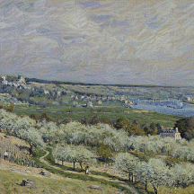
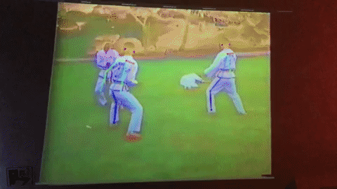

# Creative AI

I spent Summer 2017 as a Research Fellow at UGA's [Center for Undergraduate Research Opportunities](http://curo.uga.edu/index.html), where I investigated different forms of computational creativity. Most of my research centered around creative applications of machine learning, and I finally got around to posting the code for my notes and experiments involving Convolutional Neural Nets, Style Transfer, and Variational Autoencoders along with some other stuff.

In the root folder I've placed code for an ongoing side-project *Notions of a Cloud*, which uses a Variational Autoencoder on videos of clouds to create interesting generative output.

In the notes folder, you'll find some images and more notes from my run-through of [Parag Mital's](http://pkmital.com/home/) course [Creative Applications of Deep Learning](https://www.kadenze.com/courses/creative-applications-of-deep-learning-with-tensorflow/info).

You'll also find some handy python utilities, which I didn't write but use extensively in my notes.   

I'm presenting at the [CURO Symposium](http://curo.uga.edu/symposium/index.html) in April, but until then here's my [presentation](https://docs.google.com/presentation/d/1h8gafvFUFiknPVE_Fg9cK57R3oBZyplId22bA5T9A1Q/edit?usp=sharing) from the Summer Research Forum, if that's something you're into.

